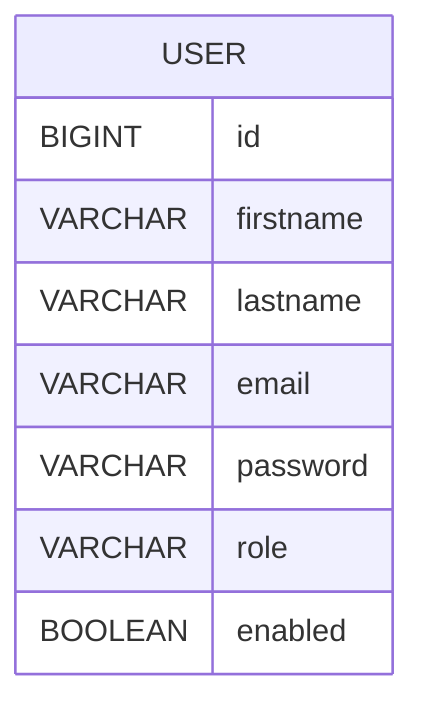

# User Management Service

The User Management Service is a repository that provides a comprehensive solution for managing user accounts and authentication within the system. It allows for the creation, storage, updating, retrieval, deactivation, and authentication of user information. This readme file will guide you through the features and implementation details of the User Management Service.

## Features

The User Management Service offers the following features:

1. User Creation: The service allows the creation of new users with necessary information, including password, email, and role.

2. Secure Storage: Users' information, such as password, email, and role, is securely stored and encrypted within the system. This ensures the confidentiality and integrity of user data.

3. User Information Update: The service provides functionality to update user information, including password, email, and role. This allows for the modification of user details as required.

4. User Information Retrieval: The service offers a view functionality to retrieve user information based on email or other search criteria. This allows for easy access to user data when needed.

5. User Activation and Deactivation: The service supports user activation and deactivation, which disables user access while keeping the account and associated data intact. This is useful for scenarios where temporary user access suspension is required.

6. Password Hashing and Salting: The User Management Service implements secure password hashing and salting techniques to protect user passwords. This ensures that passwords are not stored in plain text and are resistant to unauthorized access.

7. User Sign-In: The service provides a user sign-in functionality that validates the provided credentials against stored user information. This allows for secure authentication and access control within the system.

8. Error Handling: The User Management Service handles authentication failures and provides appropriate error-coded responses to the user. This helps in identifying and resolving authentication-related issues effectively.

## Implementation

The User Management Service is implemented using industry-standard best practices for security and user management. It utilizes robust encryption algorithms for secure data storage and implements secure password hashing and salting techniques to protect user passwords. The service follows established protocols for user authentication and handles authentication failures gracefully.

The service is built using java and spring frameworks and libraries that are suitable for secure user management and authentication. It leverages modern cryptographic algorithms and protocols to ensure the confidentiality and integrity of user data.

## Database Schema

## Conclusion

The User Management Service provides a secure and efficient solution for user management and authentication within a system. With its features for user creation, secure storage, information update, retrieval, deactivation, password hashing, salting, and error handling, it offers a comprehensive set of functionalities to meet user management needs in the system. 